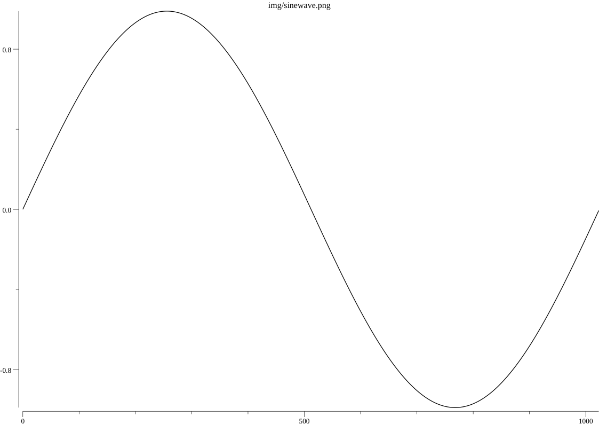

# timeseries generator
Generate common uniformly sampled timeseries using Go.
Used mostly for testing filter functions or other technical analysis indicators

## Requirements
- Gonum for plotting in tests:
``
go get -u gonum.org/v1/gonum/...
``

## Installation:
``
go get github.com/MathisWellmann/timeseries-generator
``

### Functions include:
- SineWave
- StepFunction
- UniformProcess
- GaussianProcess
- OHLCV generator

Tests which generate images are available to get an idea of the function behaviour.

### Images:

